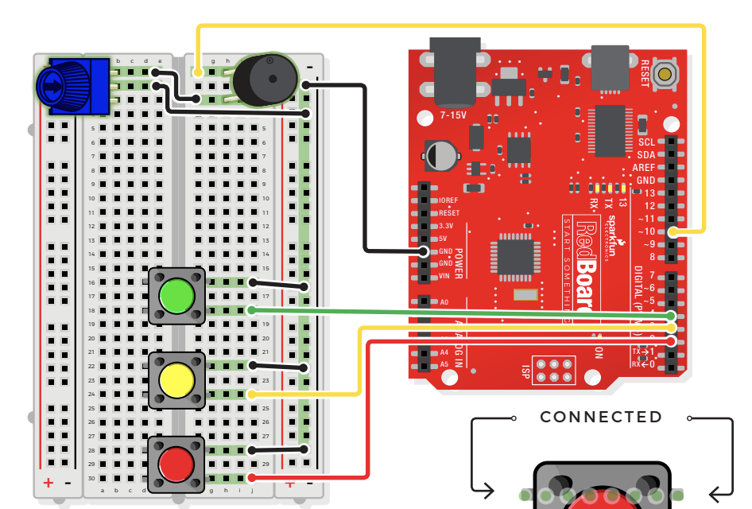

# Digital Trumpet

## Components
- Buttons
    - aka "momentary switches"
    - only remain ON as long as they're being actuated (pressed)
    - best used for intermittent use-input cases (reset button and keypad buttons)
    - all of the buttons behave the same, no matter their color
- Potentiometer
    - 3 pin variable resistor
    - depending on the position of the knob on the potentiometer, the middle pin outputs a voltage between 0V and 5V
    - inside there's a single resistor and a wiper, which cuts the resistor in two and moves to adjust the ratio between both halves
    - aka "trimpot" or "knob"
    - not polarized
- Piezo Buzzer
    - buzzer uses a small magnetic coil to vibrate a metal disc inside a plastic housinfg
    - by pulsing electricity through the coil at different rates, different frequencies (pitches) of sound can be produced
    - attatching a potentiometer to the output allows you to limit the amount of current moving through the buzzer and lower its volume
    - the buzzer is polarized! look at the underside of the buzzer to determine + and -
- 10 Jumper Wires

## Connections

- JUMPER WIRES
    - **GND** to GND(-)
    - **D10** to F1
    - **D4** to J18
    - **D3** to J24
    - **D2** to J30
    - E2 to GND(-)
    - J16 to GND(-)
    - J22 to GND(-)
    - J28 to GND(-)
    - E1 to F3
- BUZZER
    - H1(+) to H3(-)
- PUSH BUTTONS
    - green(D16/18 to G16/18)
    - yellow(D22/24 to G22/24)
    - red(D28/30 to G28/30)
- POTENTIOMETER
    - B1 + B2 + B3

## Digital Trumpet Demo Video
[Buzzer Trumpet Demo](https://youtube.com/shorts/Wl5HJLiyvP0 "Buzzer Trumpet")

> ***NOTE***    Bolded connections indicate origin on RedBoard