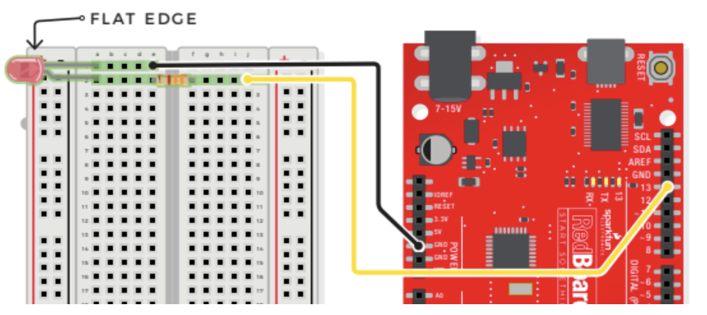

# Morse Code Blinking LED

## Components

- Light-Emitting Diodes (LEDs)
    - Has a positive (+) long leg and a negative (-) short leg (flat)
    - Only lets electricity flow through them in one direction
    - Always use a resistor to limit the current when you wire an LED into a circuit because LEDs can burn out if too much electricity flows through them
    - LED is a polarized component which only works when electricity flows in one direction
    - OHMS LAW: `V = IR` (used to calculate what resistor values are suitable to sufficiently limit the current flowing to the LED so that it doesn’t get too hot and burn out)
- 330 OHM Resistor
    - Resists the flow of electricity
    - Used to protect sensitive components like LEDs
    - Does not have polarity (electricity can flow through in either direction)
- 2 Jumper Wires

## Connections

- JUMPER WIRES
    - **D13** to J2
    - **GND** to E1
- LED
    - A1(-) to A2(+)
- 330 OHM RESISTOR
    - E2 to F2

## "I Love You" Demo Video
[I Love You Demo](https://www.youtube.com/shorts/uJ-GWfDeTOI "I Love You Demo")

> ***NOTE***    Bolded connections indicate origin on RedBoard