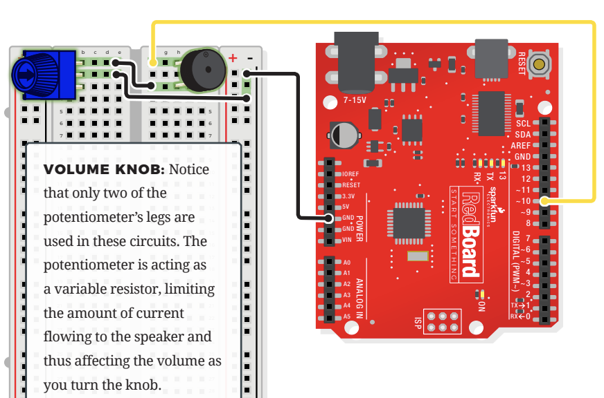

# Music Buzzer

## Components
- Potentiometer
    - 3 pin variable resistor
    - depending on the position of the knob on the potentiometer, the middle pin outputs a voltage between 0V and 5V
    - inside there's a single resistor and a wiper, which cuts the resistor in two and moves to adjust the ratio between both halves
    - aka "trimpot" or "knob"
    - not polarized
    - in this circuit, only two of the potentiometer's legs are used. this is because it acts as a variable resistor, limiting the amount of current flowing to the speaker and thus affecting the volume as you turn the knob
- Piezo Buzzer
    - buzzer uses a small magnetic coil to vibrate a metal disc inside a plastic housinfg
    - by pulsing electricity through the coil at different rates, different frequencies (pitches) of sound can be produced
    - attatching a potentiometer to the output allows you to limit the amount of current moving through the buzzer and lower its volume
    - the buzzer is polarized! look at the underside of the buzzer to determine + and -
- 4 Jumper Wires

## Connections

- JUMPER WIRES
    - **GND** to GND(-)
    - **D10** to F1
    - E2 to GND(-)
    - E1 to F3
- BUZZER
    - H1(+) to H3(-)
- POTENTIOMETER
    - B1 + B2 + B3

## Music Buzzer Demo Video
[Buzzer - Marry You](https://youtube.com/shorts/RjP-dNPCjcY?feature=share "Marry You Buzzer")

> ***NOTE***    Bolded connections indicate origin on RedBoard

