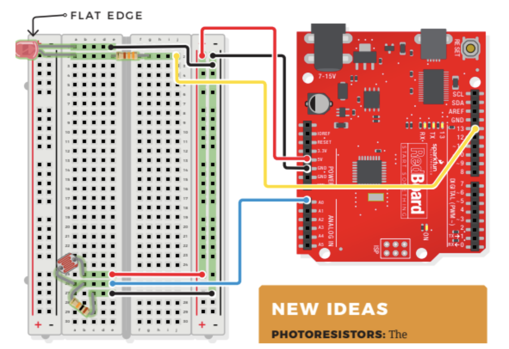

# Photoresistor LED

## Components
- Photoresistor
    - light sensetive
    - as more light shines on the sensor's head, the resistance between its two terminals decreases
    - not polarized
- LED
- 330 OHM Resistor
- 10K OHM Resistor
- 7 Jumper Wires

## Connections

- JUMPER WIRES
    - **5V** to 5V(+)
    - **GND** to GND(-)
    - **D13** to J2
    - **A0** to E26
    - E1 to GND(-)
    - E25 to 5V(+)
    - E27 to GND(-)
- LED
    - A1(-) to A2(+)
- 330 OHM RESISTOR
    - E2 to G2
- 10K OHM RESISTOR
    - B26 to C27
- PHOTORESISTOR
    - A26 to B25

## Photoresistor Demo Video
[Photoresistor LED](https://youtube.com/shorts/AS3ucsYgyIQ "Photoresistor")

> ***NOTE***    Bolded connections indicate origin on RedBoard
