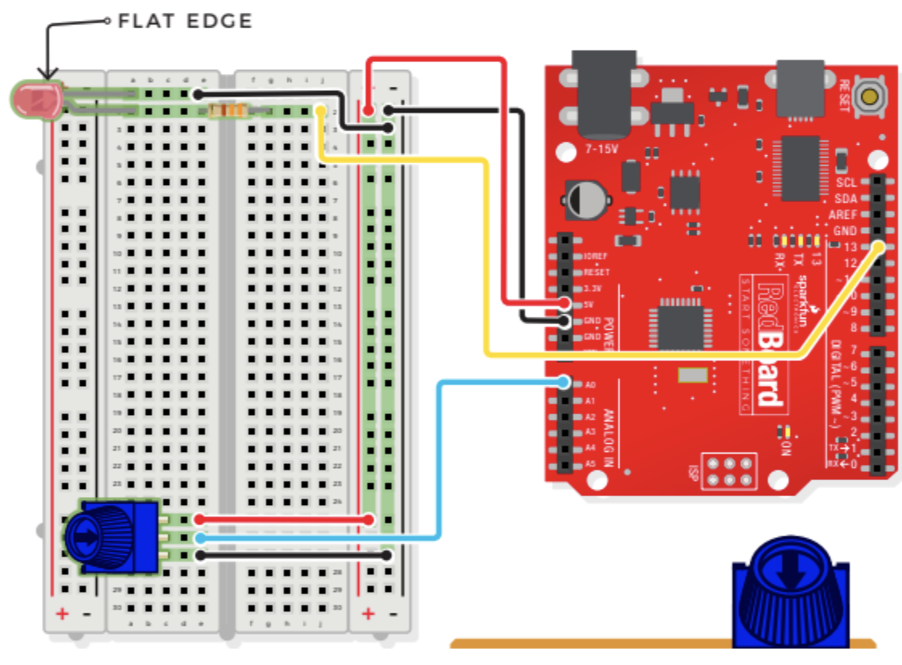

# Potentiometer Blinking LED

## Components
- Potentiometer
    - 3 pin variable resistor
    - depending on the position of the knob on the potentiometer, the middle pin outputs a voltage between 0V and 5V
    - inside there's a single resistor and a wiper, which cuts the resistor in two and moves to adjust the ratio between both halves
    - aka "trimpot" or "knob"
    - not polarized
- Light-Emitting Diode (LED)
- 330 OHM Resistor
- 7 Jumper Wires

## Connections

- JUMPER WIRES
    - **5V** to 5V
    - **GND** to GND(-)
    - **A0** to E26
    - E25 to 5V(+)
    - E27 to GND(-)
    - E1 to GND(-)
    - **D13** to J2
- LED
    - A1(-) to A2(+)
- 330 OHM RESISTOR
    - E2 to G2
- POTENTIOMETER
    - C25 + C26 + C27

## Potentiometer Demo Video
[Potentiometer](https://youtube.com/shorts/raVJGzP8mHg "Potentiometer")

> ***NOTE***    Bolded connections indicate origin on RedBoard
