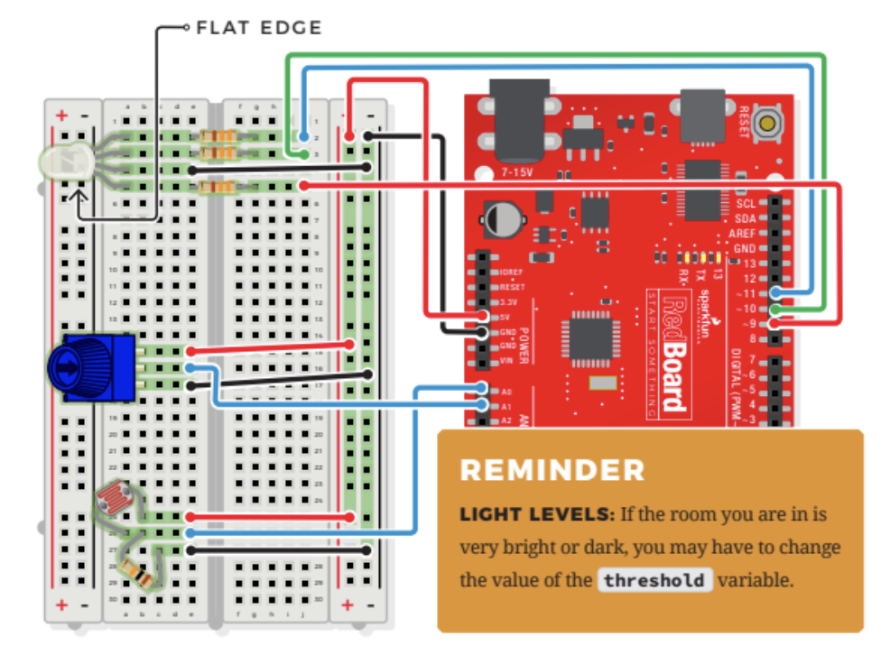

# RGB Night Light

## Components
- RGB LED
    - 3 small LEDs in 1 (red, green, blue)
    - all the internal LEDs share the same ground wire, so there's 4 legs in total
    - to turn on just one color, connect to ground and power one of the legs (don't forget current limiting resistors)
    - if you turn on more than one color at a time, colors start to blend together to form a new color!
    - 
- Photoresistor
- 3 330 OHM Resistors
- 10K OHM Resistor
- 12 Jumper Wires
- Potentiometer

## Connections

- JUMPER WIRES
    - **5V** to 5V(+)
    - **GND** to GND(-)
    - **D9** to J5
    - **D10** to J3
    - **D11** to J2
    - **A0** to E26
    - **A1** to E16
    - E15 to 5V(+)
    - E17 to GND(-)
    - E4 to GND(-)
    - E25 to 5V(+)
    - E27 to GND(-)
- RGB LED
    - A5(red) + A4(GND) + A3 (green) + A2(blue)
- 330 OHM RESISTORS
    - E2 to G2
    - E3 to G3
    - E5 to G5
- 10K OHM RESISTOR
    - B26 to C27
- PHOTORESISTOR
    - A26 to B25
- POTENTIOMETER
    - B15 + B16 + B17

## NightLight Demo Video
[NightLight](https://youtube.com/shorts/zL-x4DLNIDI "NightLight")