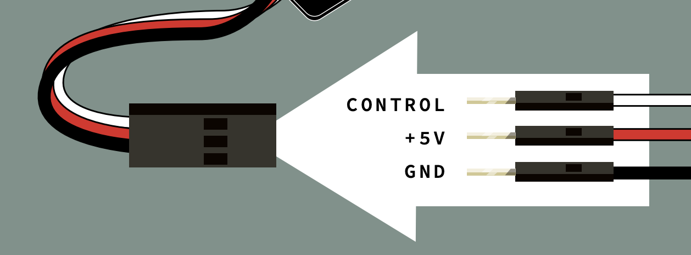
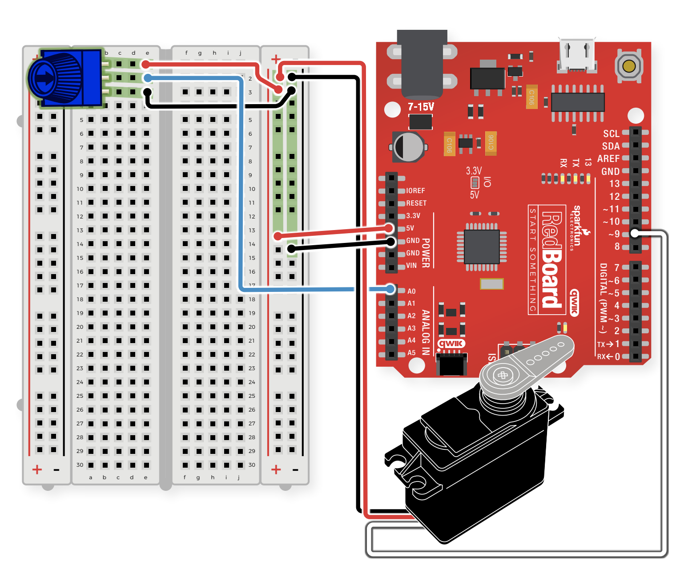

# Servo Motor

## Components
- Potentiometer
    - 3 pin variable resistor
    - depending on the position of the knob on the potentiometer, the middle pin outputs a voltage between 0V and 5V
    - inside there's a single resistor and a wiper, which cuts the resistor in two and moves to adjust the ratio between both halves
    - aka "trimpot" or "knob"
    - not polarized
- Servo Motor
    - has 3 wires: one for power, one for ground, and one for signal
    - when you send the right signal through the signal wire, the servo will move to a specific angle and stay there
    - common servos rotate over a range of about 0 to 180 degrees
    - the signal that is sent is a PWM signal
    - connector is polarized (connect 3 jumper wires to the female 3-pin header on the servo in order to connect the servo to the breadboard)
    - 
- 8 Jumper Wires

## Connections
 
 - JUMPER WIRES
    - **A0** to E2
    - **5V** to 5V(+)
    - **GND** to GND(-)
    - E1 to 5V(+)
    - E3 to GND(-)
- POTENTIOMETER
    - B1 + B2 + B3
- SERVO LEADS
    - WHITE WIRE to **D9**
    - RED WIRE to 5V(+)
    - BLACK WIRE to GND(-)

## Servo Motor Demo Video
[Servo Demo](https://youtube.com/shorts/PUz1oMA72OQ)

> ***NOTE***    Bolded connections indicate origin on RedBoard