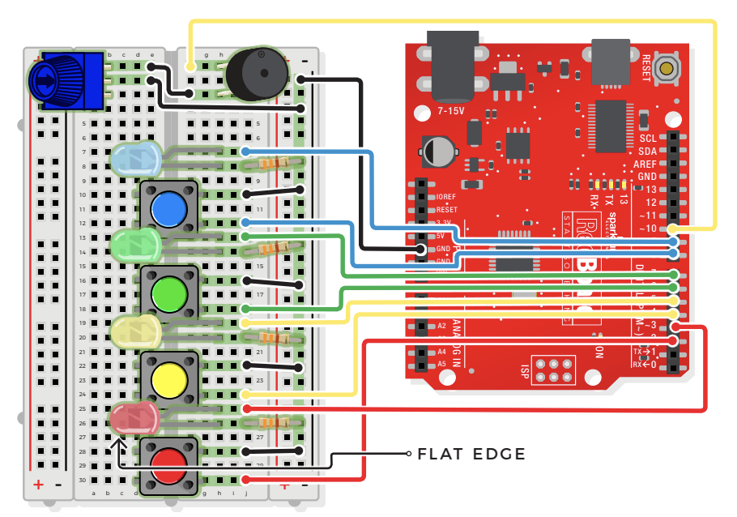

# "Simon Says" Game

## Components
- 4 Light-Emitting Diodes
    - Has a positive (+) long leg and a negative (-) short leg (flat)
    - Only lets electricity flow through them in one direction
    - Always use a resistor to limit the current when you wire an LED into a circuit because LEDs can burn out if too much electricity flows through them
    - LED is a polarized component which only works when electricity flows in one direction
    - OHMS LAW: `V = IR` (used to calculate what resistor values are suitable to sufficiently limit the current flowing to the LED so that it doesn’t get too hot and burn out)
- Potentiometer
    - 3 pin variable resistor
    - depending on the position of the knob on the potentiometer, the middle pin outputs a voltage between 0V and 5V
    - inside there's a single resistor and a wiper, which cuts the resistor in two and moves to adjust the ratio between both halves
    - aka "trimpot" or "knob"
    - not polarized
- Piezo Buzzer
    - buzzer uses a small magnetic coil to vibrate a metal disc inside a plastic housinfg
    - by pulsing electricity through the coil at different rates, different frequencies (pitches) of sound can be produced
    - attatching a potentiometer to the output allows you to limit the amount of current moving through the buzzer and lower its volume
    - the buzzer is polarized! look at the underside of the buzzer to determine + and -
- 4 Push Buttons
    - aka "momentary switches"  
    - only remain ON as long as they're being actuated (pressed)
    - best used for intermittent use-input cases (reset button and keypad buttons)
    - all of the buttons behave the same, no matter their color
- 4 330 OHM Resistors
- 16 Jumper Wires

## Connections

- JUMPER WIRES
    - **GND** to GND(-)
    - **D10** to F1
    - **D9** to J7
    - **D8** to J12
    - **D7** to J13
    - **D6** to J18
    - **D5** to J19
    - **D4** to J24
    - **D3** to J25
    - **D2** to J30
    - E2 to GND(-)
    - E1 to F3
    - J16 to GND(-)
    - J22 to GND(-)
    - J28 to GND(-)
    - J10 to GND(-)
- BUZZER
    - H1(+) to H3(-)
- LEDS
    - blue: H7(+) to H8(-)
    - green: H13(+) to H14(-)
    - yellow: H19(+) to H20(-)
    - red: H25(+) to H26(-)
- POTENTIOMETER
    - B1 + B2 + B3
- PUSH BUTTONS
    - blue: D10/12 to G10/12
    - green: D16/18 to G16/18
    - yellow: D22/24 to G22/24
    - red: D28/30 to G28/30
- 330 OHM RESISTORS
    - J8 to GND(-)
    - J14 to GND(-)
    - J20 to GND(-)
    - J26 to GND(-)
